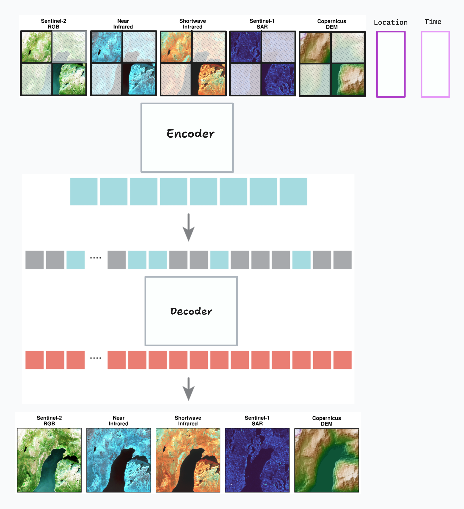
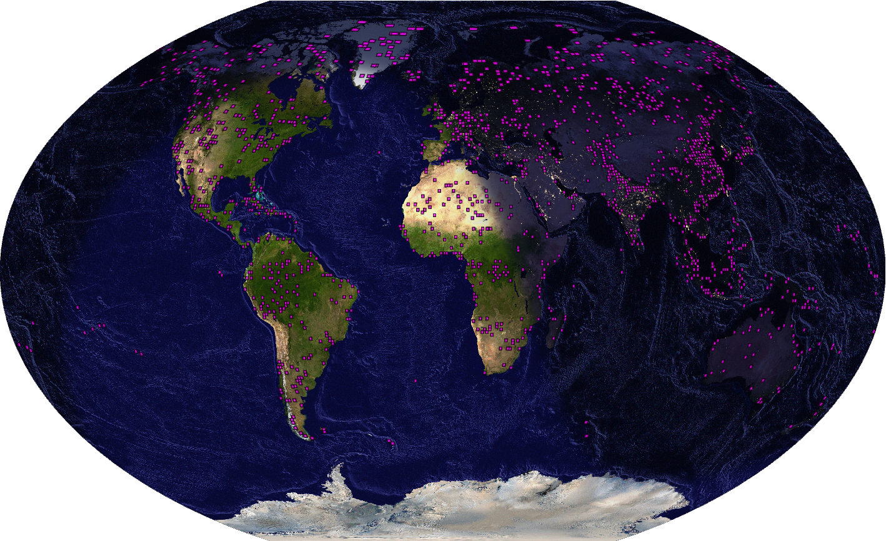
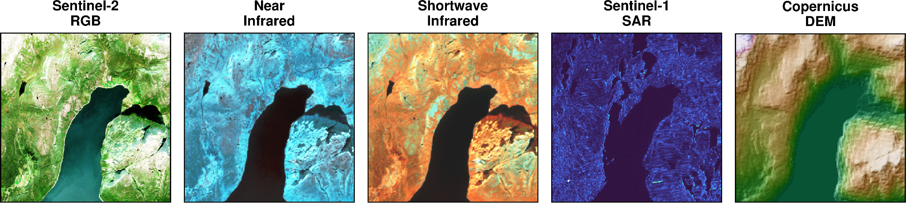
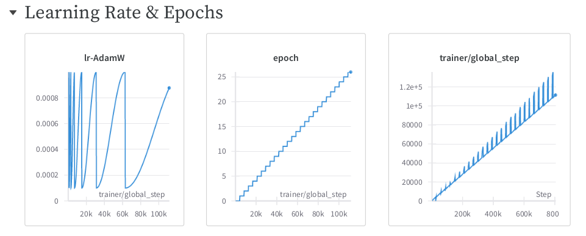
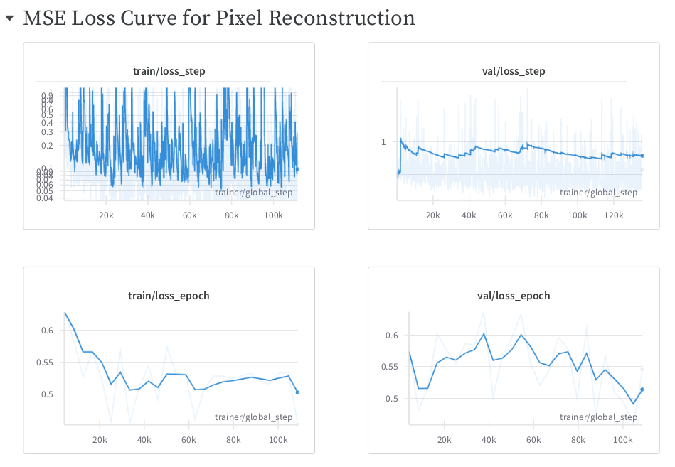
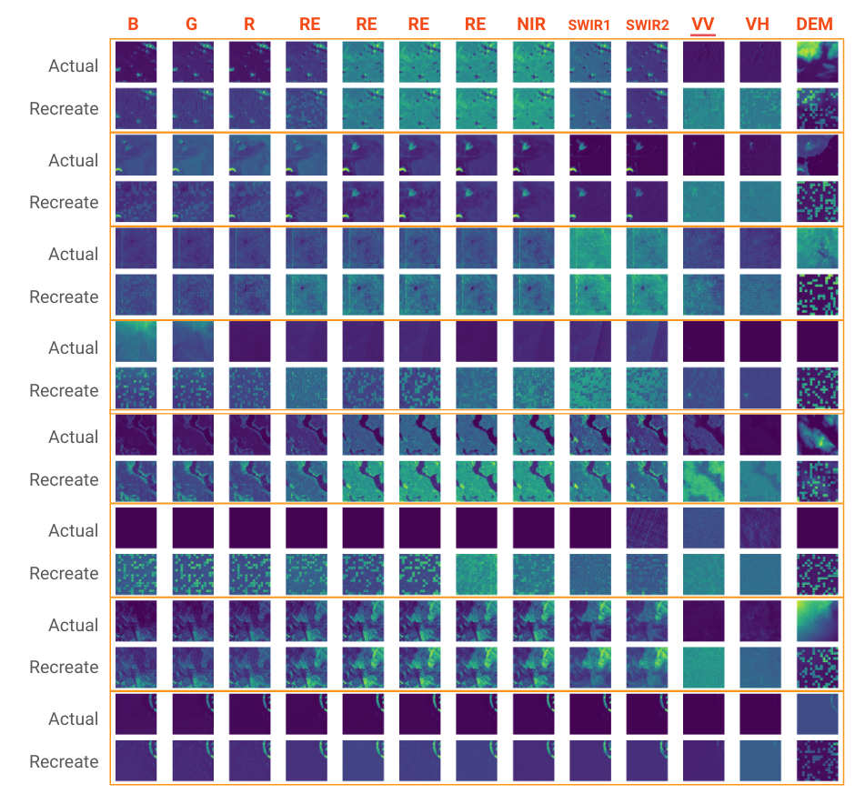

# CLAY v0

## Model Architecture



## Model Card

For v0 of CLAY, we used the `clay_small` model.

```
MASKED PATCHES = 75%
INPUT SIZE = 13 bands x 512 width x 512 height
PATCH SIZE = 32 x 32

OPTIMIZER
    Adam
    Learning rate = 1e-4
    Weight decay = 0.05
    Beta 1 = 0.9
    Beta 2 = 0.95

SCHEDULER
    CosineAnnealingWarmRestarts
    T_0 = 1000
    T_mult = 2
    eta_min = Learning rate * 10

ENCODER
    dim = 768
    depth = 12
    heads = 12
    dim_head = 64
    mlp_ratio = 4
    dropout = 0.0
    emb_dropout = 0.0

DECODER
    decoder_dim = 512
    decoder_depth = 8
    decoder_heads = 8
    decoder_dim_head = 64
    decoder_mlp_ratio = 4
    decoder_dropout = 0.0
```

## Data Card

Training dataset size: `6.4 TB`  
Number of unique MGRS Tiles: `1203`  
We picked 3 timesteps for each tile, so we have `3609 Tiles` in total. Each MGRS tile covers an area of 10km x 10km. The tiles are sampled intelligently, so that we have a good coverage of the different landscapes.  




We then create chips of size `512 x 512` from each tile, so we have around `~1.2 Million` chips in total. Each chip contains `13 bands`, 10 of which are the Sentinel-2 bands, 2 are Sentinel 1 bands & 1 DEM band.
We store each chip as geotiff, along with their coordinate & timestamp information that is used for model training.




## Training Card





## Results

> CLAY v0 with 75% masked images as input to the model.

